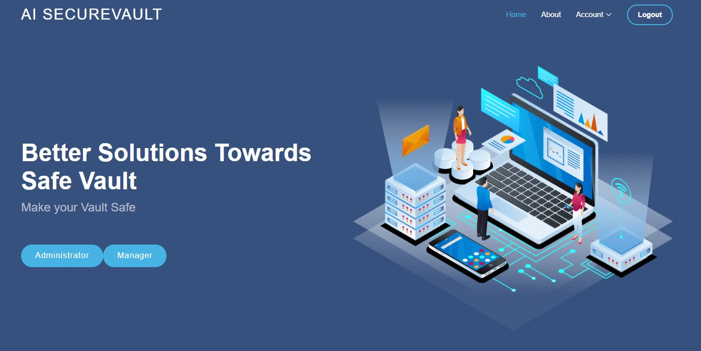

# AI-Smart-SecureVault

# Foobar

This App is developed for Smartly Accessing the Vault authorized by Artificial Intelligence and Computer Vision




## Installation


```bash
pip install -r requirements.txt
```

## Usage

```python
python manage.py runserver
```

## Technologies
Project is created with:
* Django: 3.0.6
* SQLite3
* AI

## To-Do's
* Implement Face, Voice, Fingerprint Modules
* Accessing Webcam and other modules from Front-End 
* After All three steps, add into the Database 